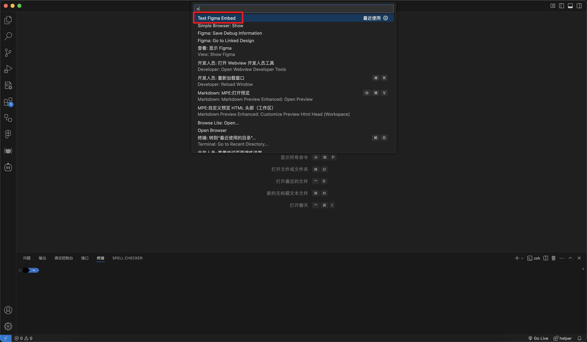
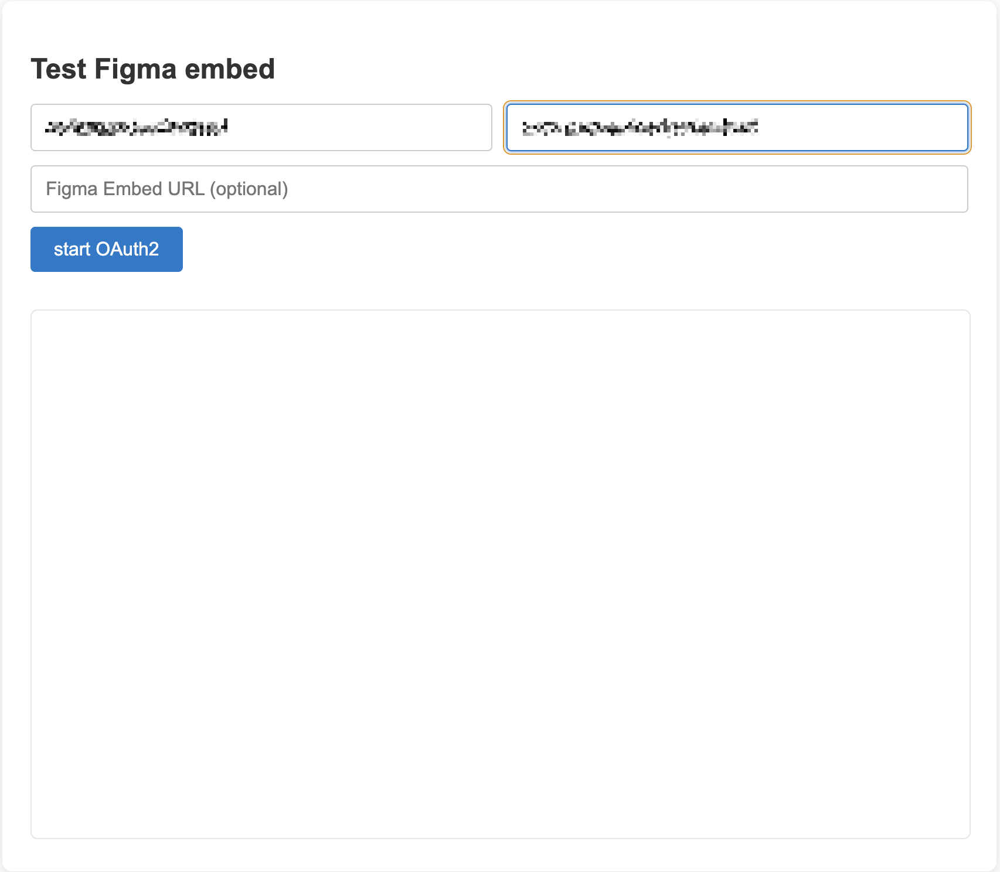
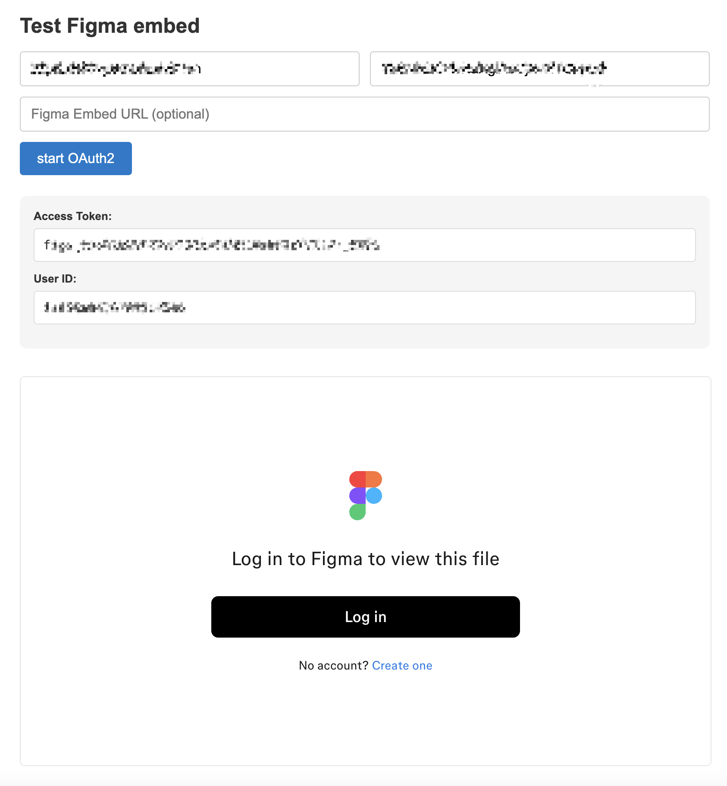

# README

This repository is a VSCode extension project designed to embed Figma within the extension.

## Setup

1. Clone the repository and install dependencies:
    ```
    git clone https://github.com/oudintest/TestFigmaEmbed.git
    cd TestFigmaEmbed
    npm install
    ```

2. Open the project in VSCode, then click the "Run Extension" button in the debug panel to launch the extension.

## Usage


1. After launching the extension, press Cmd+Shift+P on macOS to open the command palette, then type and select the Test figma embed command.

    

2. A page will appear where you can enter your **client_id** and **client_secret**. Click the start OAuth2 button to perform Figma OAuth2 authentication.
    

> Tip: For testing convenience, the Redirect URLs are currently set to http://localhost:3001/figma/callback

3. After successful authentication, the extension will display the obtained **access_token** and **user_id_string**, and attempt to embed a Figma file that the current user has access to. The result looks like this:
    